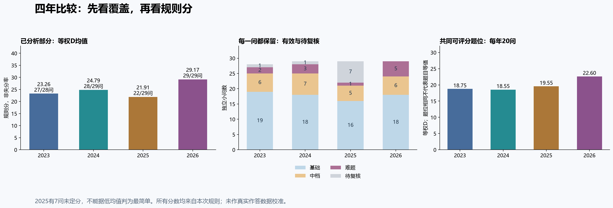

# 题目难度分析算法

**把“这道题难不难”拆成可检查的解题步骤、评分依据与教学批注。**

本项目源于一次2023—2026上海秋季高考数学整卷分析：不是只做难度汇总表，而是保留试卷内容、核验解析、逐小问评分，再解释教师应该讲透什么。

当前发布 **v0.1.2**：一个可独立运行的规则评分程序、可安装的分析 Skill、完整分析提示词、115个小问的案例记录、三组对比图、项目总结和发展规划。

> 这是尚未实测校准的结构难度规则，不是学生失分率预测。程序不会自动证明答案正确，也不会仅凭题干自动给出可靠评分；解题、划步、六维赋值和证据目前由教师或AI提供并审校。



## 从哪里开始

| 你想做什么 | 阅读位置 |
|---|---|
| 看项目为什么做、完成了什么、还缺什么 | [项目总结](docs/项目总结.md) |
| 理解H、C、T、D、B的含义和计算 | [算法说明](docs/算法说明.md) |
| 按规则完整分析一张新卷 | [通用提示词](prompts/整卷难度量化与解析关键批注-通用提示词.md) |
| 在 Codex 中反复处理单题、题组或整卷 | [题目难度分析 Skill](skills/question-difficulty-analysis/SKILL.md) |
| 看四年难度变化与教学洞察 | [四年案例洞察](docs/四年案例洞察.md) |
| 查看未来任务和完成标准 | [发展规划](docs/发展规划.md) |
| 提交新试卷或复核已有评分 | [贡献指南](CONTRIBUTING.md) |
| 理解公开材料范围 | [数据说明](docs/数据说明.md) |

## 单题也可以使用

新增明确的单题模式：一个小问直接分析，多小问题逐问评分后作整题解读，省略不适用的整卷统计。评分公式保持v1.1，提示词更新至v1.2。

- [单题使用说明](docs/单题分析使用说明.md)
- [2024年第21题三小问示范](docs/单题示范-2024第21题.md)
- [可复算的示范输入](examples/single-multipart.json)

## 安装 Skill

Skill 已包含完整工作规则、单题样例和离线复算程序。把 [skill 目录](skills/question-difficulty-analysis)复制到本机 Codex 的 `skills/question-difficulty-analysis` 目录后，新任务可直接提出“按题目难度分析 Skill 分析这道题”或“按同一规则处理整卷”。已经打开的任务可能需要重新载入技能列表。

在仓库根目录可先检验打包程序：

```bash
python skills/question-difficulty-analysis/scripts/score.py skills/question-difficulty-analysis/examples/single-question.json --output result.json
python skills/question-difficulty-analysis/scripts/score.py skills/question-difficulty-analysis/examples/single-multipart.json --output multipart-result.json
```

Skill 负责规定完整教学流程；程序只复算给定步骤、六维和风险证据，仍需人工或AI核验数学内容。仓库主程序与 Skill 中的程序保持相同实现，并由测试检查同步。

## Jev 标签建议（可选）

本项目可选集成 TypeSafe 的 Jev 模型，用于**建议** K/R/A/V/P/I、T 和 B 标签。这是一个辅助功能，所有建议均需教师确认后方可使用。

**重要说明：**
- Jev 只建议标签，D 仍由规则计算
- TypeSafe 文档指出非英文文本准确率较低，阈值需在上海案例上调优
- 默认安装不包含此功能，CLI 和 API 行为不变

安装可选依赖：

```bash
pip install question-difficulty-analysis[typesafe]
```

设置 API 密钥（从 [TypeSafe 控制台](https://console.typesafe.ai) 获取）：

```bash
export TYPESAFE_API_KEY=your-key-here
```

### 填充无标签输入并评分

对于只有步骤结构但缺少 dimensions/t/B 标签的输入（如 `examples/unlabeled-question.json`），可以使用 `--suggest-labels` 填充缺失标签并评分：

```bash
# 填充缺失标签并评分，输出到终端
python -m question_difficulty examples/unlabeled-question.json --suggest-labels

# 填充并评分，同时保存可编辑的草稿供教师修改
python -m question_difficulty examples/unlabeled-question.json --suggest-labels \
    --draft-output draft.json --output result.json
```

**工作流程：**
1. Jev 为缺失字段建议标签值（已有人工标签不会被覆盖）
2. 填充后的数据由规则引擎评分（HCT-rules-v1.1 不变）
3. 输出 JSON 包含评分结果和 Jev 标记：
   - `jev_labels_pending: true` — 标签待教师确认
   - `jev_needs_review: true` — 存在低置信度或缺少题干文本
   - `jev_review_reasons: [...]` — 需要复核的具体原因
   - `jev_meta: {...}` — 原始概率分布和分歧记录

**编辑草稿后重新评分：**

```bash
# 教师编辑 draft.json 中的标签后
python -m question_difficulty draft.json --output final-result.json
```

### 评估脚本

运行评估脚本与上海数据对比（仅在设置了 API key 时运行）：

```bash
python scripts/eval_jev.py --sample 10  # 随机抽样10题评估
python scripts/eval_jev.py --limit 5 --output eval-results.json  # 前5题，输出JSON
```

如果未安装 SDK 或未设置 API key，使用 `--suggest-labels` 会输出简短提示，其他功能正常运行。

## 五分钟运行

需要Python 3.10或更新版本。直接运行不需要安装第三方库，也不需要API密钥。

```bash
git clone https://github.com/cheng-bai/question-difficulty-analysis.git
cd question-difficulty-analysis
python -m question_difficulty examples/minimal.json --output result.json
python -m unittest discover -s tests -v
```

复算四年案例：

```bash
python -m question_difficulty data/shanghai-2023-2026.json --output result.json
```

这个命令输出全部115问及合并样本统计。按年查看应分别筛选`questions`里的`year`，再调用下面的函数；跨年合并结果不能冒充任一年的整卷指标。

```python
import json
from pathlib import Path
from question_difficulty import score_paper

data = json.loads(Path("data/shanghai-2023-2026.json").read_text(encoding="utf-8"))
paper = [q for q in data["questions"] if q["year"] == 2026]
result = score_paper(paper)
print(result["statistics"])
```

也可用`python -m pip install .`安装本地包，然后运行`question-difficulty`命令。未发布到PyPI，不要假定同名包就是本项目。

## 规则要点

- **H**：最难单步的综合负荷。
- **C**：最重的一条连续依赖路径，不是全部分支工作量之和。
- **T**：入口搜索、错误发现延迟、回退与边界遗漏风险。
- **D**：按既定权重合成的规则分，0—34基础、35—64中档、65—100难题。
- **B**：独立的关键突破标记，0—3；不加入D。

步骤的六个维度为知识识别K、条件推理R、代数运算A、表征转换V、参数边界P、知识交汇I，各取0、1、2，并附实际数学动作的依据。

先审题审答案，再划步骤，再评分。缺图、题意冲突或未知风险不能悄悄记成0。小问分值未知时不均分大题分数，不发布伪造的整卷加权指数。

## 已有成果

| 年份 | 实际小问 | 可评分 | 待复核 | 已分析部分D均值 |
|---|---:|---:|---:|---:|
| 2023 | 28 | 27 | 1 | 23.26 |
| 2024 | 29 | 28 | 1 | 24.79 |
| 2025 | 29 | 22 | 7 | 21.91 |
| 2026 | 29 | 29 | 0 | 29.17 |

2025缺失问并非随机缺失，不能凭均值最低就判定该年最简单。不同年份题位相同也不意味着题目等值。原始案例评分是回归测试快照，仍允许依据新证据修订。

本地研究曾产出四份完整教师阅读版、一份总报告及评分明细。公开仓库包含我们生成的分析数据、方法、批注与统计图；第三方整卷原文、原解析、原图和私人文件路径不随仓库分发。使用者需自行准备适用材料。

## 当前能做与尚未实现

已实现：输入检查、精确四舍五入、依赖路径计算、机械重复折扣、冲突隔离、完整覆盖率和分值明确子集统计、115问回归检查、跨系统自动测试配置。

尚未实现：通用Markdown试卷自动读取、自动解题与证据可靠性验证、自动生成教师阅读版、网页编辑器、PDF导出、真实学生数据校准。原任务的人工/AI阅读与专用整理脚本不能冒称为通用自动化能力。

主程序的计算使用Python标准库。案例图表来自原研究的Matplotlib绘制结果，图表生成器尚未整理为公共接口。

## 开源与贡献

代码、原创项目文档及本项目形成的审校批注采用[MIT许可证](LICENSE)。第三方材料不因此获得本许可证授权；数据事实、数学公式与第三方引用的适用权利各自独立。

欢迎提供可定位的数学纠错、独立复评、程序测试和经过授权的新案例。不要只提交“感觉太难/太简单”的数字；请附题目位置、主解步骤和评分证据。

本次开源前复算发现并修正8问H的浮点取整问题，其中3问D增加1，档位均不变。当前案例为case-v1.1；[旧值与新值](data/scoring-corrections.json)单独保留。

---

版本号：v1.2
更新日期：2026-09-24
更新说明：新增可安装的单题与整卷分析 Skill，内含完整规则、样例和离线复算程序。
