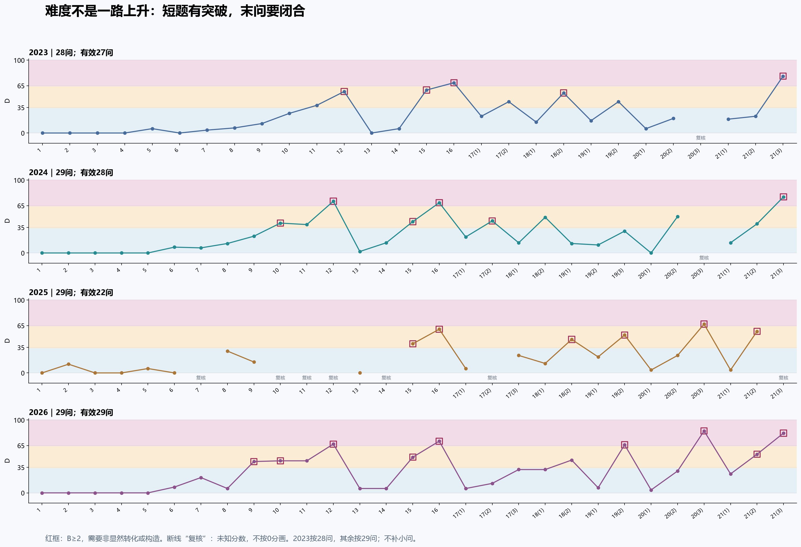
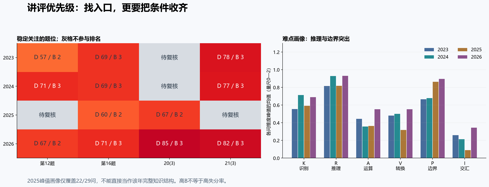

# 2023—2026上海秋季高考数学｜四年完整跑卷总报告

案例公开版：v1.2｜2026-09-24｜依据指定本机Markdown重新分析

> 2026-09-24复算修订：旧浮点实现把8问的H=57.5向下算成57，现修为58；其中3问D增加1，档位不变。本文与图表采用case-v1.1数据，旧值见[修订清单](../data/scoring-corrections.json)。

## 一、先说结论与可信边界

本次已经逐一处理115个独立小问：2023年28问，2024—2026年各29问。四份教师版保留原题、原图、原答案解析，并另写可用于讲评的审校解；关键批注紧跟对应步骤。评分以本次解题步骤重新生成，没有沿用旧评分表。

**最值得带走的结论有三条。** 第一，按本次规则，2026的已核验部分呈现更高的中后段负担，尤其20(3)、21(3)，但四年不能描述成稳定逐年递增。第二，12题、16题以及20、21题末问是稳定值得检查的题位，其中短题也会有明显突破门槛。第三，2025的材料冲突足以改变年度判断，不能因它当前均值最低就宣称它最简单。

这是一份规则型结构分析，不是官方难度鉴定，也不是学生得分率预测。未输入学生背景、未假定考试完成时间、未对原卷真伪进行官方认证。数学推导的“已核验”与“确为官方最终题面”是两回事。

## 二、统计范围与年度变化

全部115问都进入阅读版与总表。106问可按当前明确题意给出确定规则分；9问保留条件性完整解或反例，H/C/T/D/B留空。缺失分数不填0，也没有为2023硬补第29问。

| 年份 | 有效/实际 | 覆盖率 | 等权D均值 | 中位数 | 最高D | 总体标准差 | 基础/中档/难题 |
|---|---|---|---|---|---|---|---|
| 2023 | 27/28 | 96.4% | 23.26 | 17 | 78 | 23.21 | 19/6/2 |
| 2024 | 28/29 | 96.6% | 24.79 | 14.0 | 77 | 23.22 | 18/7/3 |
| 2025 | 22/29 | 75.9% | 21.91 | 14.0 | 67 | 21.72 | 16/5/1 |
| 2026 | 29/29 | 100.0% | 29.17 | 26 | 85 | 26.66 | 18/6/5 |

表中均值是**已分析部分的小问等权规则指数**。2023—2025原材料可合计满分150，但均未提供解答题各小问明确配分；2026所给文件也未明确解答题总配分与整卷时间。本次没有给解答题小问均分，因此不发布精确整卷分值加权指数或完整分值档位占比。每卷仅对分值明确的72分客观题另外统计，并写明其有效分值覆盖率。

2023与2024均值相差约1.53分，本身不宜解读为显著升降；它们的共同可评分题位均值几乎相同。2026已核验均值较高，短题到末问的高负担更分散，不只是单独一道题抬高最高分。2025既有漏条件又有冲突阈值，缺失问并非随机丢失，更不能把余下22问当作整卷的无偏样本。

### 对缺失材料做两种敏感性检查

第一种，只比较四年都有且可定分的同一题位，共20个。这样可以避免某年独有或未评分题位改变分母，但同题号可能换模块、换任务，**它不构成等值试卷比较**。

| 年份 | 共同可评分题位数 | 该子集等权D |
|---|---|---|
| 2023 | 20 | 18.75 |
| 2024 | 20 | 18.55 |
| 2025 | 20 | 19.55 |
| 2026 | 20 | 22.60 |

共同题位：1、2、3、4、5、6、8、9、13、15、16、17(1)、18(1)、18(2)、19(1)、19(2)、20(1)、20(2)、21(1)、21(2)。

这一口径下2025高于2023、2024，说明“2025最简单”的结论对样本选择不稳健。2026仍最高，但差值约3—4分，且尚受划步、评分者判断和题目内容差异影响。

第二种，把未定分问仅作为未知量，允许其D在0—100任意取值，计算全体小问等权均值的数学边界。下表是极端敏感性范围，**不是置信区间，也不是给冲突题补分**。

| 年份 | 未定分问数 | 全体等权D的可能数学范围 |
|---|---|---|
| 2023 | 1 | 22.43—26.00 |
| 2024 | 1 | 23.93—27.38 |
| 2025 | 7 | 16.62—40.76 |
| 2026 | 0 | 29.17—29.17 |

在本次固定评分之下，2026的29.17甚至高于2023、2024上述缺失边界的上端；这让“2026在当前规则中高于2023、2024”的结论较稳。但2025范围很宽，不能把它排在任何确定位置。以上边界没有覆盖评分者主观差异，也不支持真实考试难度的绝对排名。

## 三、难度在哪里跳升，哪些位置稳定承压

各行使用当年真实小问数和题序。灰字“复核”是断点，未画成0分；红框表示B≥2。图中上下起伏也包含解答题从前一道末问回到下一道首问的自然重置，不能把每一次回落当作命题突然变简单。

| 题号区间 | 2023 D均值（有效/实际） | 2024 | 2025 | 2026 |
|---|---|---|---|---|
| 1—6 | 1.00（6/6） | 1.33（6/6） | 3.00（6/6） | 1.33（6/6） |
| 7—12 | 24.33（6/6） | 32.33（6/6） | 22.50（2/6） | 37.50（6/6） |
| 13—16 | 33.50（4/4） | 32.00（4/4） | 33.33（3/4） | 33.00（4/4） |
| 17—19 | 32.67（6/6） | 26.14（7/7） | 27.17（6/7） | 28.71（7/7） |
| 20—21 | 29.20（5/6） | 36.20（5/6） | 31.20（5/6） | 46.67（6/6） |

**前六题稳定承担基本定义和公式运用。** 本规则把识别直接、短运算、无转换的步骤记0，所以这里出现极低均值。它揭示的是六维量尺的下限，不表示这些题“没有难度”，更不能据此删去基础训练。

**第12、16题是短题入口的观察窗口。** 2023第12题先辨顶点身份，第16题把曲线问题改成距离集合；2024第12题抓区间拼接，第16题把集合条件解释为左侧纪录；2025第16题用混合参数端点压缩三角形条件；2026第12题排特殊点对应，第16题判断旋转圆与坐标平面相切。它们共同要求找结构，但不是同一套路，也不能单靠“新定义”标签评分。

**20、21题末问是稳定的综合压力位置，但不能承诺四年每一道都能定量排名。** 2023、2024的20(3)保留题意冲突；2025的21(3)缺偶性版本不能沿用后部答案。可核验的2026两末问分别为D=85、82，强调完整条件链。2023与2024的21(3)分别为78、77，也都要求把关键突破推进到结论闭合。

**解答题首问仍是独立入口。** 各年20(1)都是圆锥曲线基本量，不能被同题末问的高难标签覆盖。整题笼统标“难”，会把本可直接教学或检查的首问一起淹没；这正是按独立小问统计的价值。

## 四、我的详细教学洞察

### 1. 最容易被短答案遮住的，是“把条件翻译对”

2024第10题，“任意两者之积为偶数”先变成至多一个奇数；第12题，“差集是闭区间”真正要求的是中间无缺口。2025第16题，“任意λ都成三角形”转成最大边小于两倍最小边。2026第15题，“伴随”必须化为两个析取的虚部条件，再取交集。

这些题不宜先训练复杂计算。更有效的讲评产出是一句可检验的等价表述：原条件如何改写、为何必要、为何充分。复测可只更换条件中的一个量词或端点，检查原转换是否还成立。只有名词解释，没有等价性证明，不算完成这个训练。

### 2. 存在性、唯一性、最优性是三个不同的证明任务

2023第21(3)证明最多三项之后，还需要零点定理构造三项；2024第21(2)有导数零点之后，还要证明它是全局最近点。2026第20(3)中弦长能匹配只是存在，严格单调与参数对应才给唯一。2026第12题找到一组可行椭圆，只完成存在，仍须排除其他边长对应才得到唯一离心率。

讲评时应让每段证明有清楚的终点：这一段获得的是候选、上界、存在还是唯一？这比把完整答案从头抄到尾，更能暴露缺口。正文已对上述题补齐逻辑，而未把新增解释的行数自动当成更多计分步骤。

### 3. 很多“最后一步错了”，实际是前面没有保存限制条件

2023第18(2)分母禁值在解分子方程后仍必须保留；20(3)被删掉的P=A改变严格不等式端点。2024第17(2)换元t=1/x始终有t>0。2025第19(2)根m/2必须在正半轴，还要与1比较并排重根。2026第19(1)抵消分式不能抵消x≠0；19(2)无交点端点是相切，不能包含。

建议把“限制条件清单”放在解答边上，随着换元和消元更新，而不是等答案出来再凭记忆补。复测不只检查区间答案，还要求解释每个开端点为什么开、每个挖去点为什么挖去。

### 4. 运算组织有价值，但不能混同入口搜索风险

2025第20(3)和2024第20(3)条件性解都只需根和根积，不必写两个交点根式。2026第19(2)用统一斜率参数一次解决两条线；2025第17(3)用均值点直接预测，比先算大截距更易核对。

这些是减少运算失误的组织方法。A评价运算负荷，T评价选错入口、错误延迟和返工范围；长算式本身不能给T加分。本次原材料确有计算或转录错，但这些事实也不等于学生会以同样频率出错。

### 5. “任意函数”的压轴应训练可用条件，而非猜具体函数

2024第21(3)通过两次最小性相加，锁定共同最近点；2026第21(3)通过固定步长增量累加，与有界性矛盾。后者既不需要连续，也不能擅自假定凹函数。2025第21(3)则必须先靠偶性制造同值点；缺偶性的版本，用全域f(x)=1−x就能说明结论不受保证。

这三问适合形成一个专题：手里只有定义、单调、有界、最小性或对称性时，怎样制造可重复使用的关系。训练目标应是找到让条件发生作用的对象，不是背某一个函数表达式。

### 6. B补充了突破门槛，但没有取代D，也没有校准它

本次B≥2的有效小问数为2023年5问、2024年6问、2025年6问、2026年9问，分母分别27、28、22、29。它描述要不要跨越非显然关系；D还混合了单步强度、依赖链和返工风险。不能把二者相加得到新的“总难度”。

六维峰值平均显示，推理R和边界P比纯运算A更突出。这一结论有逐题动作支持：区间接合、全称量词、等号可达、参数退化、存在唯一。它不意味着实际失分主要来自R或P；要做失分归因，需要真实作答记录。

## 五、材料问题：哪些必须回原卷，哪些已经修正

### 暂停确定评分的9问

| 年份/小问 | 冲突或缺口 | 本次处理 |
|---|---|---|
| 2023 20(3) | 题干“任意异于A的动点P”包含$t=-a$，但此时Q不存在。原解析也未覆盖$t+a<0$，并漏斜率不存在情形。条件解释未定，H/C/T/D/B确定值暂停发布；所列步骤仅作条件性解答。 | 保留原文和条件性解；数值评分留空 |
| 2024 20(3) | 原题“连接OQ并延长”按通常射线方向不会到达对称点R；配图与解析实际使用QO越过O延长。方向措辞冲突尚待原卷核实，不发布确定评分。原解析$b^2=10-3b^2\ne1$应为$b^2m^2=10-3b^2\ne1$。 | 保留原文和条件性解；数值评分留空 |
| 2025 7 | 前部$A_1C=9$；后部$AC=9$。条件不同且后者矛盾，按前部可得112，但原卷版本待复核。 | 保留原文和条件性解；数值评分留空 |
| 2025 10 | 前部模$\le1$、后部模$=1$；两个版本答案巧合相同。来源未定，确定评分留空。 | 保留原文和条件性解；数值评分留空 |
| 2025 11 | 前部填空目标乱码，后部完整题明确角度制精确0.01度且有图。条件性解后部版本；原卷要求仍待核对。 | 保留原文和条件性解；数值评分留空 |
| 2025 12 | 前部未写“平面”，后部写“平面向量”；本版明确选后部完整表述作数学审校，仍列版本冲突、暂停确定评分。原解析另有符号值与点积值混淆。 | 保留原文和条件性解；数值评分留空 |
| 2025 14 | 前部指数$s$、后部指数3；选项D与两版题干均不相容。疑似缺“充分条件”等措辞，不能恢复唯一题意。 | 保留原文和条件性解；数值评分留空 |
| 2025 17(2) | 前后阈值210／211冲突，概率分别5/12和3/10；待原卷核定，不发布确定评分。 | 保留原文和条件性解；数值评分留空 |
| 2025 21(3) | 前部漏“偶函数”，后部有；前部条件不足以推出所给结论，例如$f(x)=1-x$全域严格递减使所有$M_a$为空，满足包含关系却在$(1,2)$不等于$x-1$。仅给后部条件性完整解，确定评分暂停。 | 保留原文和条件性解；数值评分留空 |

复核优先顺序建议：先找2025第14题的完整问法、17(2)的阈值、21(3)是否写明偶性；再核2023第20(3)是否排除平行直线、2024第20(3)延长方向；最后核2025第7、10、11、12题的版本差异。前五项会改变问题是否成立或具体答案，优先级高于排版笔误。

### 有充分数学依据、已经明示修正的代表项

| 位置 | 原材料问题 | 本次修订 |
|---|---|---|
| 2023 15 | 由区间直接断言a>0，且D无完整排除证明 | 单列a=0，补公共端点反证 |
| 2023 16 | “椭圆封闭所以总能找到”缺证明 | 用最小/最大距离连续乘积与倒数区间补证 |
| 2024 10 | 百位选择数误写成256 | 百位8种，256是4×8×8的总数 |
| 2024 15 | A、B文字串写 | 统一用xz平面反例检查 |
| 2025 8 | 等号点a=1/2、b=2不满足原约束 | a=2、b=1/2 |
| 2025 17(1) | 中位数式子出现210.67，数据表是210.68 | 按两处一致数据表得210.015 |
| 2025 17(3) | 预测204.65 | 211.399−0.311×22=204.557；两位为204.56 |
| 2025 19(2) | 导数多乘x，参数分类文字自相矛盾 | 因式分解为(x−1)(2x−m)/x，得m>0且m≠2 |
| 2025 20(3) | 根和根积公式损坏 | 重新联立、推导点积，得到a²<11 |
| 2026 12 | 展示成功配置但未证明唯一 | 排除另一种a及同侧对应，答案仍2/3 |
| 2026 20(3) | 参数范围直接给出，缺推导 | 用Ω的纵坐标截断补出t、u范围及端点 |

来源栏中的原错误仍然保留，并与审校解区分；这不是允许教师照抄原错误。每卷复核清单还有更细的术语、符号与路径修复记录。

图片方面，2026原文件引用失效的本机绝对路径，本次找到同目录images同名图并复制到交付包。2023、2024的12张外链原图已全部保存。2025有5幅图被损坏的图片标记挤入后一题，已核对图形内容移回相关题，并在图旁记录，未修改原图。全部交付图片均可从本地assets读取。

## 六、复习与讲评建议：按可迁移任务组织

下面是按材料结构提出的教学顺序，不是对某个学生的能力判断，也没有承诺用时与提分幅度。

| 顺序 | 教学任务 | 可直接使用的题 | 验收方式 |
|---|---|---|---|
| 1 | 定义、公式、禁值与取等 | 四年前六题；2023 8；2026 19(1) | 每个答案能用原式反代，并说出定义域 |
| 2 | 条件换成等价限制 | 2024 10、12；2025 16；2026 9、15 | 不计算前先写一句正确等价表述，能解释双向 |
| 3 | 统一参数与运算组织 | 2023 18(2)；2025 20(3)；2026 19(2) | 不解无关量，保留所有限制并展示反向验证 |
| 4 | 空间关系与投影 | 2023 17(2)；2024 18(2)；2025 18(2)；2026 16、18 | 在图上标出对应线、面、垂足，解释为何是目标角 |
| 5 | 存在、唯一、全局最优 | 2023 21(3)；2024 21(2)(3)；2026 20(3) | 给每段标“必要/充分/存在/唯一”，无逻辑跳步 |
| 6 | 抽象条件制造对象 | 2026 21(3)；2025 21(3)后部条件版 | 不额外假定连续、周期或凹凸，能说清反证矛盾来源 |

讲评优先讲“第一句为什么这样设”和“最后一句为什么够了”，中间再处理计算组织。对已经会主路径的题，复测可优先改一个边界、一个量词、一个方向；这样更能区分理解了条件与记住了答案。

冲突题用于“审题辨错”时必须贴上版本标签。未复核之前，不建议把其条件性答案放进无说明的标准答案库，更不能让学生为材料缺口承担错误评价。

## 七、评分本身还需要怎样看待

本次使用同一权重、阈值、临时步骤词典和划步口径，全部有效问公式均由程序独立复算。244个步骤实例覆盖115问，其中冲突问步骤只保留数学内容、不发布确定维度分。类型词典给出有效实例数、涉及小问数和试卷数；2025前后同题版本合并为一个单元，不重复计数。

H取最高单步；C只取一条最重依赖路径，不能代表并列必做分支的全部工作量。例如2026第20(3)的两类弦、21(3)的增减两个结论，都必须完成，但C不会把两支机械串成一条链。分支数与B因此独立保留。

划步并非唯一，C对步骤粒度敏感；本次按有意义中间结论切分，不按每行移项计步。所有r=1，因为没有认定需要折扣的同型机械重复组；不同题出现同类方法不使用重复折扣。暂时没有第二位独立评分者，所以不能宣称评分一致性经过检验。

若后续获得原卷图片及官方小问配分，最有价值的更新是：先解除9问冲突，再恢复分值加权统计，最后用同一规则由另一位教师独立复评关键题。若获得真实答卷，则可检验规则分与作答表现的关系；在此之前不把这些分数转换成预测得分。

## 八、公开数据与复用边界

本仓库公开评分依据、审校批注、逐问数据和原创统计图。原始整卷、第三方原解析和原图不随仓库发布；使用者应自行准备有使用权限的材料。完整教师阅读版是本次本地任务的交付成果，未包含在公开仓库。

- [公开案例数据](../data/shanghai-2023-2026.json)
- [逐问评分表](../data/question-scores.csv)
- [评分程序说明](../README.md)

---

版本号：v1.2
更新日期：2026-09-24
更新说明：在公开版基础上修正8问H四舍五入及3问D，更新全部统计与图表；保留case-v1.0旧值记录。
